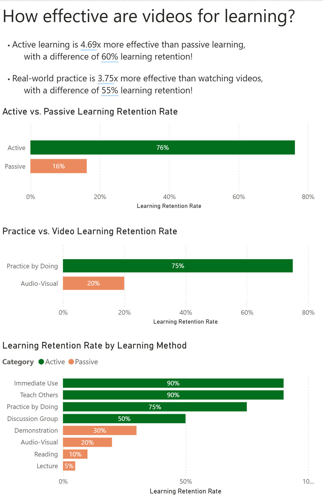

# PROJECT
# "How do we learn most effectively?"
This project uses data from psychology and Power BI to visualize the best way to skill-build quickly and meaningfully.

# Technology Used
- Power BI - report development and data modeling
- Markdown - GitHub Readme
- Visual Studio - git repository management

# Results
First, I wanted to check how effective LinkedIn Learning and YouTube tutorials were for skill building:  

  

More visualizations to come as I find more questions to answer and data to analyze.

# Implementation
- **Create a Power BI report file.**  
 This will contain our data and visualizations.
- **Load Data.**  
 Using Excel data files, manual entry for small datasets, or online sources.
- **Create the visualization.**  
 Focusing on storytelling with data, we target the key question we are looking to answer and create text boxes and charts that clearly and directly answer that question while also giving detail we may not have been aware of.  Any numbers included in text or elsewhere should be dynamic, which means building measures where needed to calculate them in real-time.

